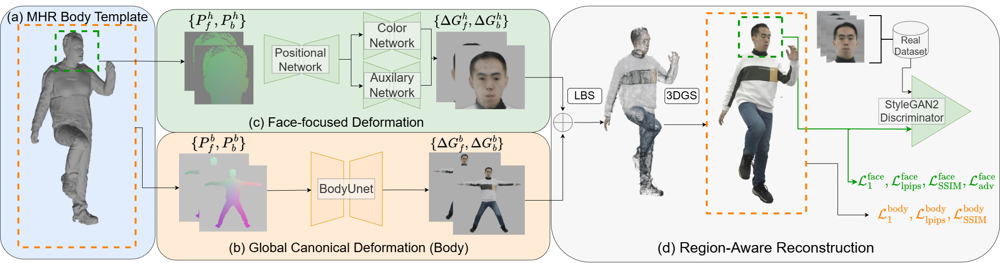
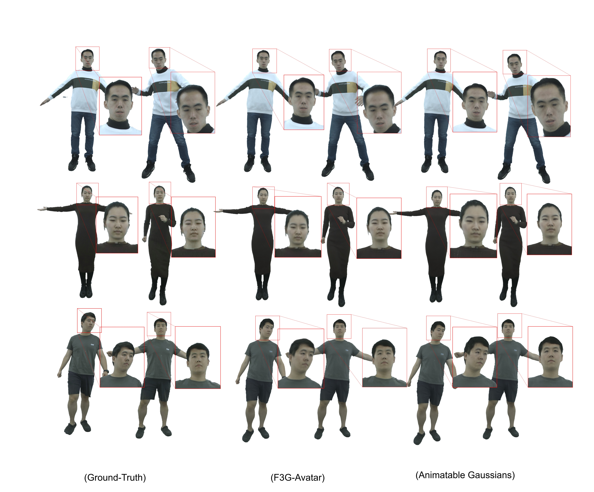

# F3G-Avatar

**F3G-Avatar: Face Focused Full-body Gaussian Avatar** · [CVPRW 2026](https://wjmenu.github.io/F3G-avatar/) · [Paper](https://arxiv.org/abs/2604.09835) · [Code](https://github.com/wjmenu/F3G-avatar) · [Project Page](https://wjmenu.github.io/F3G-avatar/)

Official PyTorch implementation for reconstructing realistic, animatable full-body human avatars from multi-view RGB video.

## Introduction



F3G-Avatar is a face-aware full-body avatar synthesis method. Starting from a clothed **Momentum Human Rig (MHR)** template, it renders front/back positional maps decoded into 3D Gaussians through a **two-branch architecture**: a body branch for pose-dependent non-rigid deformations and a **face-focused branch** for facial geometry and appearance. Gaussians are fused, posed with linear blend skinning (LBS), and rendered with differentiable Gaussian splatting. Training combines reconstruction and perceptual losses with a face-specific adversarial loss.



*F3G-Avatar displays state-of-the-art rendering quality by delivering improved facial details.*

## Models

| Checkpoint | Description | Dataset | Status |
|------------|-------------|---------|--------|
| `avatarrex_zzr` | Body + face trained avatar | AvatarReX | Coming soon |

Pretrained weights will be uploaded here under `checkpoints/`. Until then, train from scratch using the [GitHub repository](https://github.com/wjmenu/F3G-avatar).

### Download (when available)

```python
from huggingface_hub import hf_hub_download

ckpt = hf_hub_download(
    repo_id="wjmenu/F3G-avatar",
    filename="checkpoints/avatarrex_zzr/epoch_latest.pt",
)
```

## Quick start

**Code, installation, data preparation, and training** live on GitHub (kept in one place to avoid duplication):

```bash
git clone https://github.com/wjmenu/F3G-avatar.git
cd F3G-avatar
conda create -n f3g_avatar python=3.10 -y
conda activate f3g_avatar
pip install -r requirements.txt
# See README for CUDA extensions, SMPL-X, NeuS2, and MHR template pipeline
```

Train:

```bash
python main_avatar.py -c configs/avatarrex_zzr/avatar.yaml -m train
```

## Citation

```bibtex
@misc{menu2026f3gavatarfacefocused,
  title={F3G-Avatar : Face Focused Full-body Gaussian Avatar},
  author={Willem Menu and Erkut Akdag and Pedro Quesado and Yasaman Kashefbahrami and Egor Bondarev},
  year={2026},
  eprint={2604.09835},
  archivePrefix={arXiv},
  primaryClass={cs.CV},
  url={https://arxiv.org/abs/2604.09835},
}
```

## Acknowledgements

Built on [Animatable Gaussians](https://github.com/lizhe00/AnimatableGaussians), [NeuS2](https://github.com/19reborn/NeuS2), [4D-Dress](https://github.com/eth-ait/4d-dress), [PhysAvatar](https://github.com/y-zheng18/PhysAvatar), and [StyleAvatar](https://github.com/LizhenWangT/StyleAvatar).
